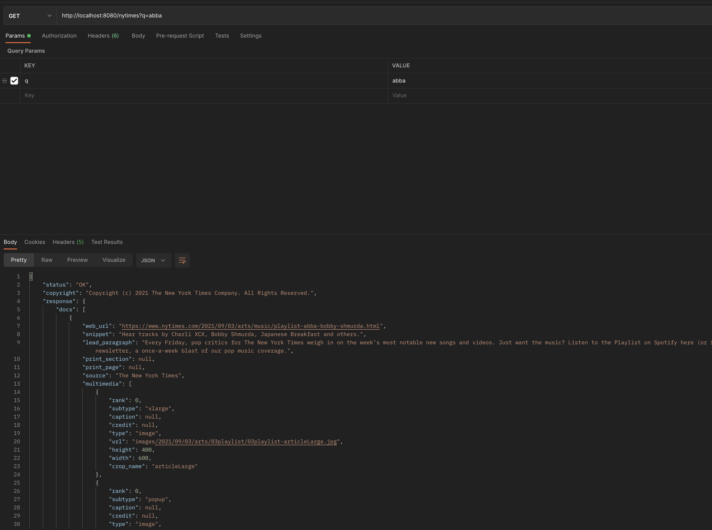
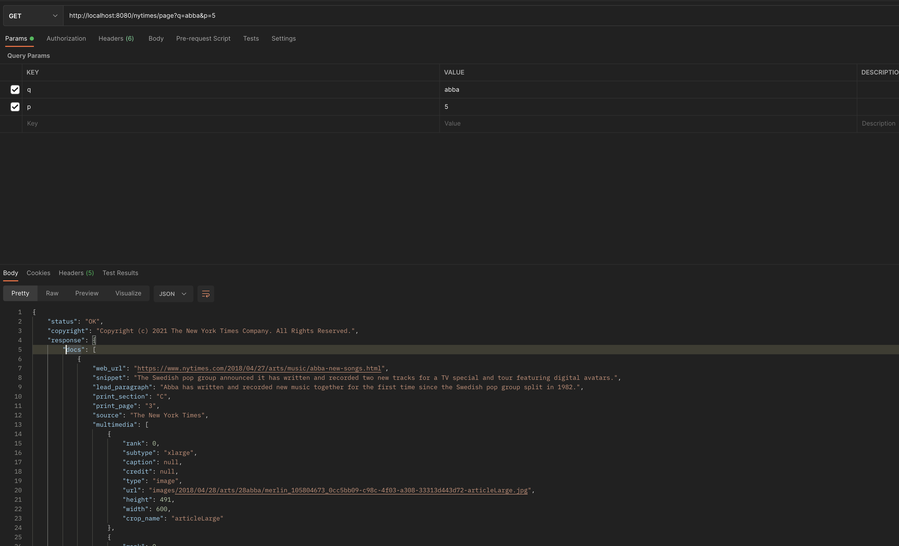
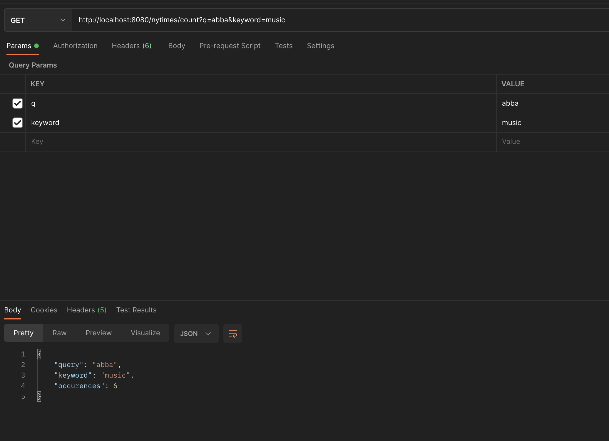
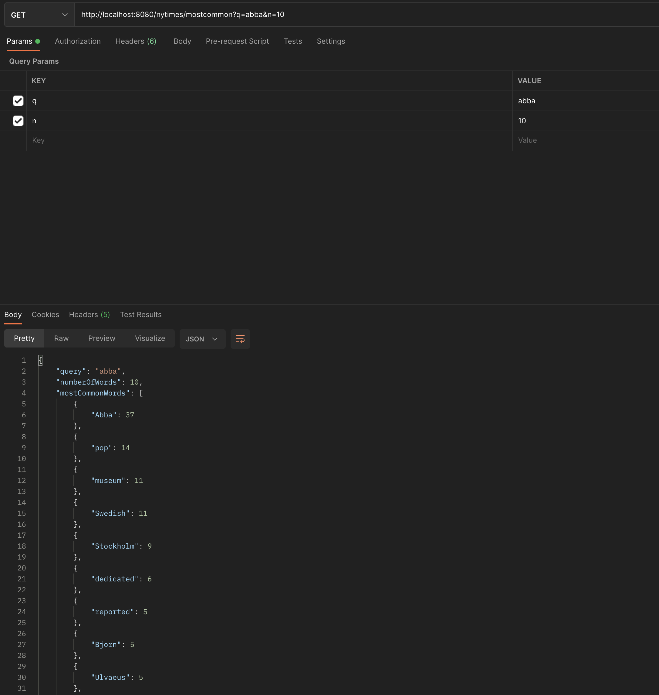
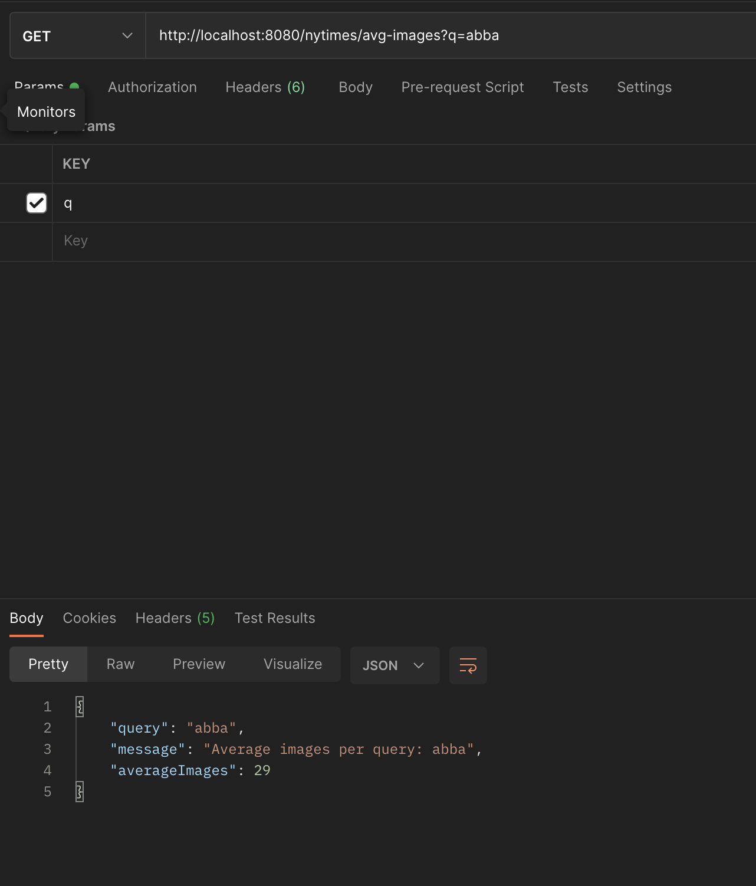

# Consuming New York Times API

This REST API built with Spring Boot consumes the New York Times API and provides some data insights.

The API features functionality including:

* Querying New York Times API
* Querying New York Times API by page number (starting with 0)
* Counting word occurrences within a query
* Listing most common words within a query
* Listing the average amount of images per article within a query

# Required Tech
Java 11, Maven, Postman (or browser with JSON plugin), IDE of your choice

# Setup & Launch

* New York Times API Key can be obtained by registering your app <a href="http://localhost:8080/api/auth/register">here</a> (enable Article Search API)


* Enter your New York Times API key in the appropriate format resources/application.properties file

  ``` 
  api_key=INSERTAPIKEYHERE
  ```
* Run ConsumingRestApplication.java


# Using REST API

## Simple Query

* Using Postman or browser, send a GET request with a query to http://localhost:8080/nytimes?q=QUERY



##  Querying by Page Number

* Send a GET request with a query and a page number (starting at 0) to http://localhost:8080/nytimes/page?q=QUERY&p=PAGE# 



# Complex Queries & Data Parsing

##  Counting Word Occurences

* Send a GET request with a query and a word to be counted (keyword) to http://localhost:8080/nytimes/count?q=QUERY&keyword=WORD

* Receive the amount of times a word appears in a query



##  Most Common Words

* Send a GET request with a query and a number of most common words you'd like back to http://localhost:8080/nytimes/mostcommon?q=QUERY&n=#_OF_WORDS

* The data is filtered by a stop word list
* Discover the n most common words in a query




##  Average images

* Send a GET request with a query to http://localhost:8080/nytimes/avg-images?q=QUERY

* Discover the average number of images per article for your query



# Credits

A HUGE thank you to the following awesome people and their tutorials that helped me navigate the world of Spring Boot and create this project

* Coding Nomads (special thanks to Ryan and Jared)

# Got Questions? Contact me!
efim@shulginmusic.com
